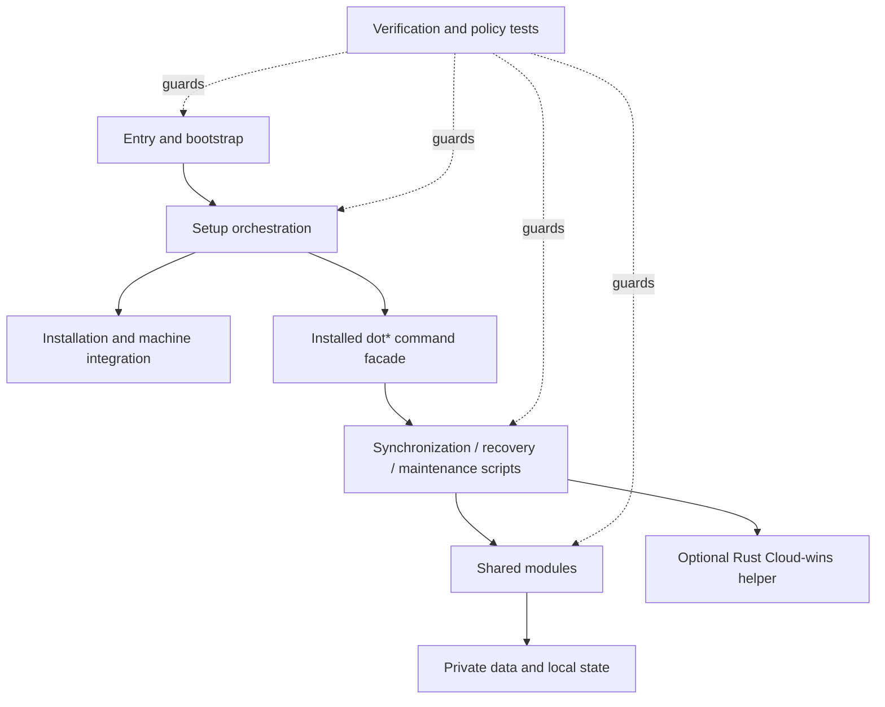

# Architecture

Initial-setup separates the stable entry point, setup orchestration, installed user commands, private synchronization, recovery, and validation into explicit layers. For the maintainer-level file and call graph, see [Code Architecture and Maintenance Map](Code-Architecture.md).

## Layered model

## Entry and setup

`setup.nu` is the stable front door. A host with a compatible Nushell and core prerequisites continues to `setup-main.nu`. Linux/macOS hosts without Nushell use `bootstrap.sh`; Windows hosts without Nushell use `bootstrap.ps1`. Bootstrap prepares the host and returns to the normal setup flow instead of implementing a separate configuration system.

`setup-main.nu` owns the setup transaction, stage classification, resume checkpoints, and final success/failure state. Required stages stop the transaction on failure. Optional feature stages retain their diagnostics as warnings and allow core setup to continue.

## Command and implementation layers

After setup, the Nushell configuration imports `scripts/modules/dotfiles.nu`, which exposes the `dot*` commands. The command facade routes work into focused `scripts/*.nu` implementations. Reusable policy and primitives live in `scripts/modules/*.nu`.

External non-interactive commands use `scripts/modules/subprocess.nu`; diagnostics use `scripts/modules/diagnostics.nu`; locks, atomic state writes, manifests, and path safety live in `scripts/modules/safety.nu`.

## Private synchronization

Private state is managed through `scripts/modules/sync-provider.nu`. The provider abstraction supports a cloud-client-managed directory, a local/NAS revision store, and an rclone revision store. Pull operations use verified staging before applying configuration, and push operations check the trusted provider baseline before publication.

Cloud-wins is intentionally separate from bidirectional synchronization. It reads a local cloud mirror, produces a reviewed plan, imports into a separate local workspace, and never uses the mirror as a write target.

## Recovery and validation

Local backups, snapshots, transaction state, operation locks, and verified rollback paths are first-class parts of mutating operations. Validation is layered through `verify.nu`, `scripts/verify-all.nu`, project/syntax checks, and focused architectural policy tests.
