# Code Architecture and Maintenance Map

This page is the maintainer-oriented map of the Initial-setup codebase. It is intended to answer two questions quickly:

1. Which layer owns a behavior?
2. Which files should be inspected first when that behavior breaks?

The user-facing architecture is summarized in [Architecture](Architecture.md). This page describes the implementation boundaries.

## Non-negotiable project boundaries

These rules define the shape of the codebase and should be preserved during refactors.

- `nu setup.nu` is the canonical setup entry point on Windows, Linux, macOS, and WSL when Nushell is available.
- Linux/macOS hosts without Nushell use `bash bootstrap.sh`. There is no `install.sh` entry point.
- Windows hosts without Nushell use `bootstrap.ps1`.
- `setup-main.nu` owns setup orchestration; bootstrap code must return to the normal setup path rather than implement a second setup system.
- Non-interactive external commands use `scripts/modules/subprocess.nu` so launch state, exit code, stdout, stderr, and diagnostics stay together.
- The three intentional terminal/process boundaries are the direct `setup.nu` -> `setup-main.nu` TTY handoff, the real-TTY managed editor path, and the self-contained seed-Nushell runtime gate.
- Required setup stages fail the transaction. Optional feature stages record warnings and allow the core setup transaction to continue.
- Synchronization direction changes are reviewable. Protected files and provider-head changes are not silently overridden.
- Cloud-wins treats the cloud mirror as read-only and imports into a separate local workspace.
- State/configuration files that participate in recovery should be written atomically where practical.
- Markdown documentation is written in English. Long-lived behavior belongs in the wiki; version-specific audit, migration, and testing documents are not generated.

## Top-level execution map

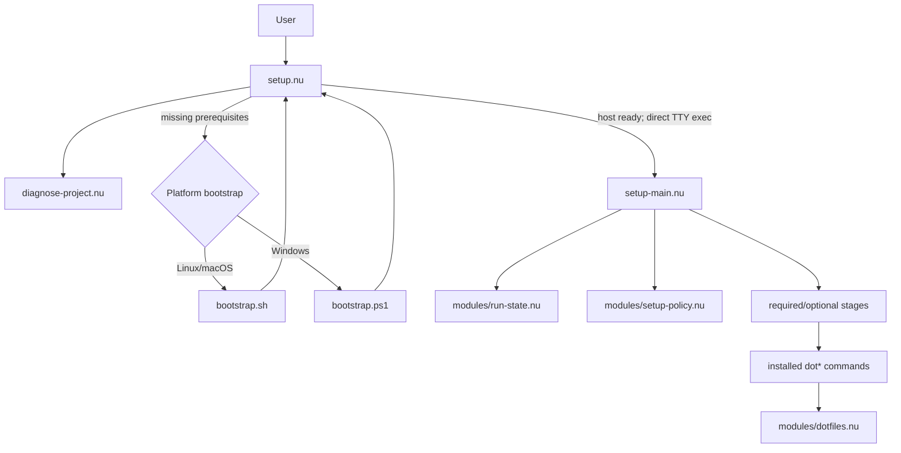

### Entry-point ownership

| Path | Responsibility | Do not move here |
|---|---|---|
| `setup.nu` | Stable front door, project preflight, prerequisite routing, and direct TTY handoff to `setup-main.nu` | Feature installation details or synchronization business logic |
| `bootstrap.sh` | Prepare a POSIX host that cannot yet run the normal Nushell setup path | A second implementation of setup |
| `bootstrap.ps1` | Prepare a Windows host that cannot yet run the normal Nushell setup path | Synchronization or user configuration decisions |
| `scripts/setup-entry.nu` | Compatibility/runtime-gated entry into `setup-main.nu` | General setup policy |
| `setup-main.nu` | Setup transaction, stage policy, resume/checkpoint behavior, final success/failure | Low-level external-command capture |

## Setup transaction

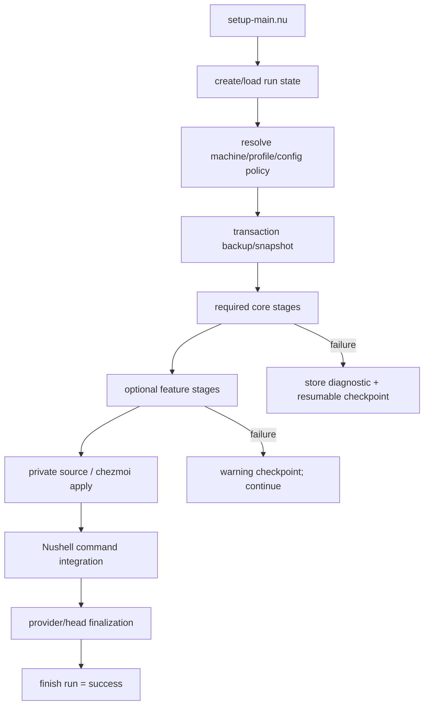

The setup transaction is intentionally split between orchestration and implementation scripts:

- `setup-main.nu` decides stage order and whether a stage is required or optional.
- `scripts/modules/run-state.nu` stores run checkpoints and resume state.
- `scripts/modules/setup-policy.nu` resolves local/private configuration authority.
- `scripts/modules/profiles.nu` resolves workstation/laptop/server/minimal feature policy.
- `scripts/install-*.nu` and `scripts/setup-*.nu` perform individual setup actions.

When setup stops unexpectedly, inspect in this order:

1. The first preserved child diagnostic in the terminal.
2. `setup-main.nu` for the stage classification and call site.
3. The called `scripts/*.nu` implementation.
4. `scripts/modules/subprocess.nu` only if the external command result itself is being lost or misreported.
5. `scripts/modules/run-state.nu` only if resume/checkpoint behavior is incorrect.

## External-command and error contract

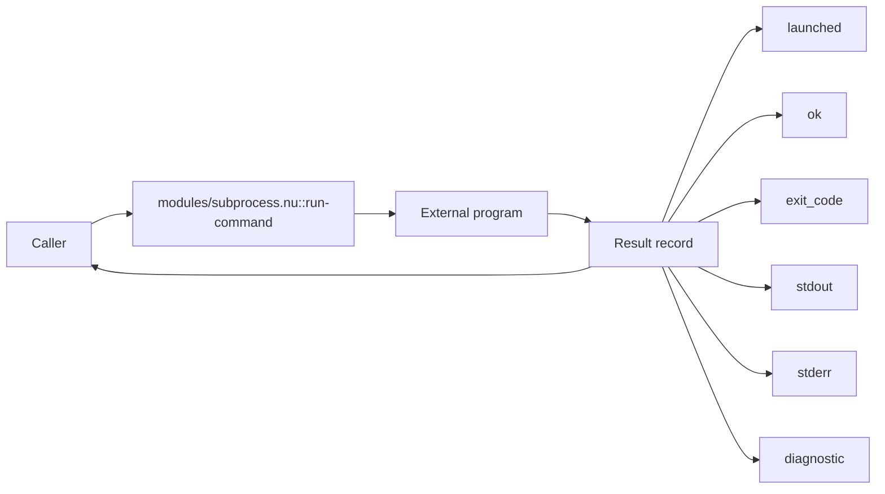

Primary files:

| Path | Role |
|---|---|
| `scripts/modules/subprocess.nu` | Shared non-interactive external-command execution contract |
| `scripts/modules/process-output.nu` | Normalizes external process output into text |
| `scripts/modules/console.nu` | Shared terminal styling for info/success/warning/error labels and colorized diffs |
| `scripts/modules/diagnostics.nu` | Converts command/tool checks into structured diagnostic results |
| `scripts/modules/install-utils.nu` | Installer-specific candidate discovery, health probes, and package-manager execution |
| `scripts/modules/core.nu` | Common machine paths and caught-error normalization |

### Intentional exceptions

- `setup.nu` transfers the terminal directly to `setup-main.nu` with `exec`; the interactive orchestrator must never be wrapped in `run-command`, `tee`, or `complete`.
- `scripts/edit-managed.nu` owns a real interactive TTY for the user's editor. Its exit code must be read immediately after the editor returns.
- `scripts/modules/nu-runtime.nu` must be parsable by the seed Nushell before the rest of the project modules can be loaded, so it keeps a minimal self-contained runtime runner with the same result semantics.

`production-subprocess-policy-test.nu` exists to prevent accidental new exceptions.

## Installed user-command layer

After setup, the Nushell configuration imports the managed command module:

```text
~/.config/nushell/config.nu
        |
        +-- use ~/.config/nushell/modules/dotfiles.nu *
                            |
                            +-- scripts/modules/dotfiles.nu
                                      |
                                      +-- dotpush / dotpull / dotdoctor / ...
```

The local installation path is managed by:

- `scripts/enable-nushell-dotfiles.nu`
- `scripts/refresh-commands.nu`
- `scripts/refresh-commands-main.nu`

`scripts/modules/dotfiles.nu` is the public command facade. It should remain thin: commands normally validate user arguments, select the appropriate script, run it, and preserve its diagnostic.

Representative routing:

| User command | Primary implementation |
|---|---|
| `dotpush` | `scripts/sync-up.nu` |
| `dotpull` | `scripts/sync-down.nu` plus `backup-local-config.nu` |
| `dotrpush` / `dotrpull` | `scripts/rclone-sync.nu` -> `scripts/sync-transport.nu` with isolated provider/state overrides |
| `dotsync` | `scripts/auto-sync.nu` |
| `dotresolve` | `scripts/resolve-config.nu` |
| `dotsnapshot` | `scripts/create-snapshot.nu` |
| `dotrollback` | `scripts/rollback.nu` |
| `dotdoctor` | `scripts/doctor.nu` |
| `dotpreflight` | `scripts/preflight.nu` |
| `dotlocalbackup` / `dotlocalrestore` | `scripts/backup-local-config.nu` |
| `dotbackend` | `scripts/backend-control.nu` |
| `dotcloud` | `scripts/cloud-wins.nu` |
| `dotvault` | `scripts/secret-vault.nu` |
| `dottoolchain` | `scripts/toolchain-state.nu` |
| `dotnuupdate` | `scripts/update-nushell.nu` |
| `dotupgrade` | `scripts/safe-upgrade.nu` |

See [Command Reference](Command-Reference.md) for the full user-facing list.

## Synchronization architecture

The synchronization code has three distinct layers.

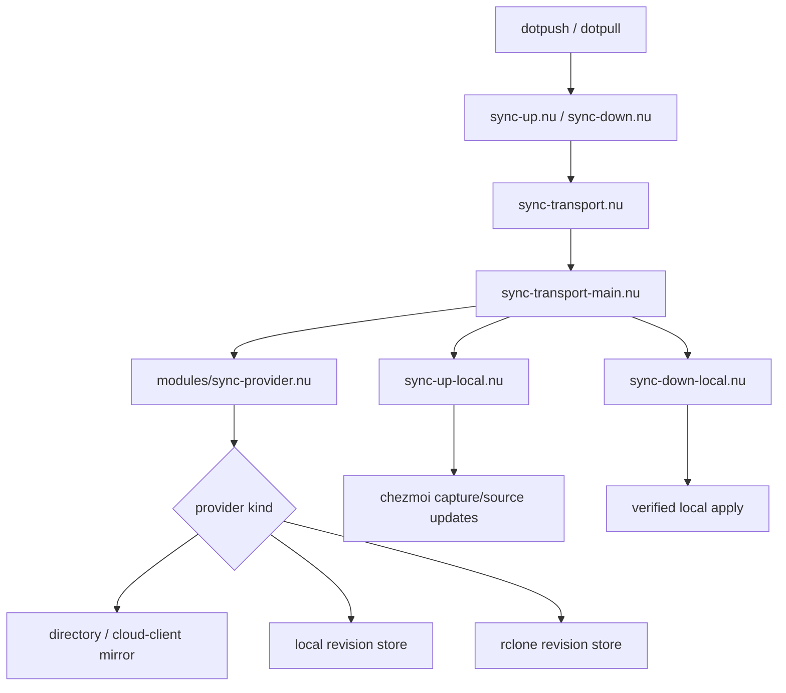

### Provider layer

`scripts/modules/sync-provider.nu` owns:

- provider configuration and identity,
- provider HEAD and trusted baseline state,
- stable observation of directory/cloud-client mirrors,
- workspace manifests and SHA-256 tree hashes,
- immutable revision publication for local/rclone providers,
- verified revision fetch,
- provider-head concurrency checks,
- workspace installation with rollback support.

The provider kinds are:

| Kind | Meaning |
|---|---|
| `directory` | The private data root itself is synchronized by an external cloud client such as Proton Drive. It has no transactional remote HEAD, so stable repeated observations are required. |
| `local` | A local/NAS revision store with immutable revisions and a HEAD record. |
| `rclone` | A remote revision store accessed through rclone with immutable revisions and a HEAD record. |

### Push flow

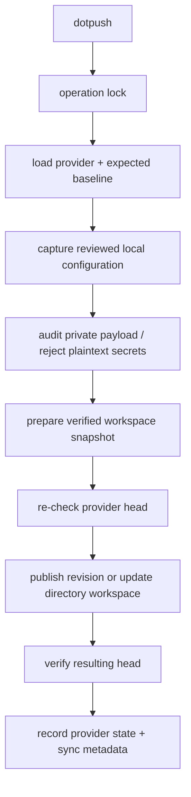

### Pull flow

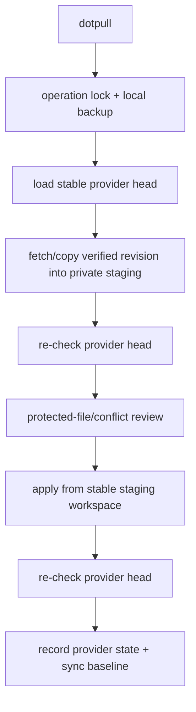

For a `directory` provider, pull never intentionally applies directly from a mirror that may still be changing. It first obtains a stable observed state and verified staging copy.

## Recovery and safety architecture

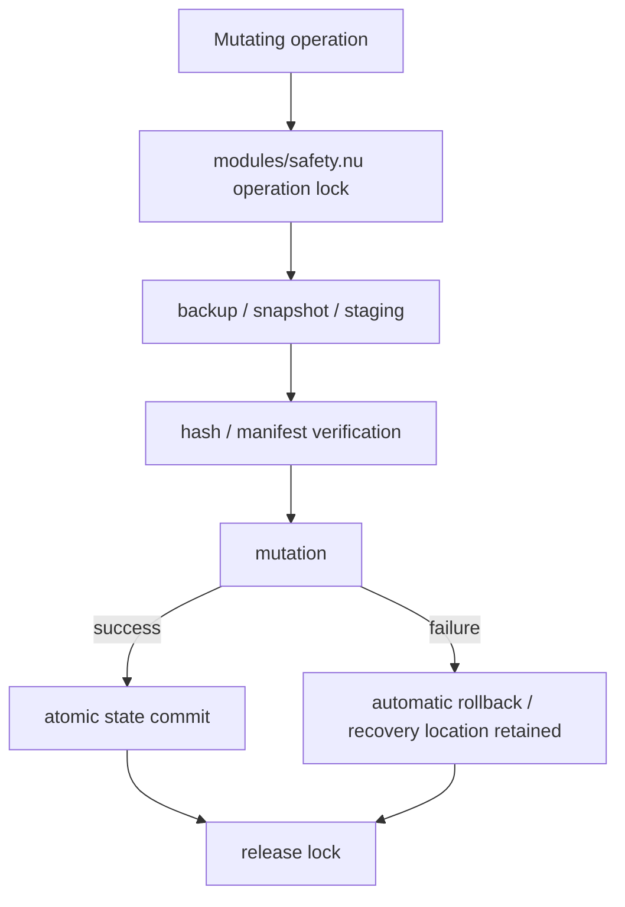

Primary files:

| Concern | Files |
|---|---|
| Locking, atomic records, path validation, tree manifests | `scripts/modules/safety.nu` |
| Setup transaction state and resume | `scripts/modules/run-state.nu`, `scripts/run-control.nu` |
| Machine-local backup/restore | `scripts/backup-local-config.nu` |
| Private workspace snapshots | `scripts/create-snapshot.nu`, `scripts/rollback.nu` |
| Protected-file conflict detection | `scripts/modules/conflicts.nu`, `scripts/resolve-config.nu` |
| Secret encryption/restoration | `scripts/modules/vault.nu`, `scripts/secret-vault.nu` |

New backup/snapshot formats include hashes. Older supported formats remain compatibility inputs but do not gain integrity metadata retroactively.

## Cloud-wins architecture

Cloud-wins is deliberately not another bidirectional provider. It is a guarded one-way import path.

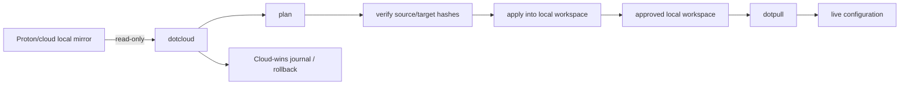

Implementation boundaries:

| Path | Responsibility |
|---|---|
| `scripts/cloud-wins.nu` | User-facing wrapper |
| `scripts/cloud-wins-main.nu` | Configure/plan/apply/activate/deactivate orchestration |
| `scripts/modules/cloud-wins-config.nu` | Local-only Cloud-wins control state and path separation |
| `scripts/modules/cloud-wins-engine.nu` | Verified Rust binary receipt and JSON invocation |
| `scripts/cloud-wins-build.nu` | Explicit Rust helper build |
| `tools/cloudwins/` | Plan/apply/status/rollback engine |

When Cloud-wins is active, normal push/export behavior is intentionally blocked until the mode is explicitly deactivated.

## Configuration and state layout

The repository itself contains public tooling. Machine and synchronization state live outside the checkout.

```text
~/.config/dotfiles/
├── config.nuon                 # machine context: tools_root, data_root, profile, ...
├── local.nu                    # machine-local Nushell setup; never synchronized
├── platform.nu                 # machine-local PATH/platform bridge
├── sync-provider.nuon          # provider configuration
├── provider-state.nuon         # trusted provider baseline
├── cloud-wins.nuon             # local-only Cloud-wins control state
├── locks/                      # local operation locks
├── runs/                       # setup transaction history/checkpoints
├── transfers/                  # private staging/fetch areas
├── cloud-wins/                 # Cloud-wins local journals/state
├── cache/                      # locally built/runtime caches
└── ...                         # backups and diagnostic state
```

The private `data_root` is separate from the public repository and contains the payload consumed by chezmoi/provider synchronization. Provider payload roots are defined centrally by `sync-provider.nu`.

## Shared modules

The following table is the quickest map of `scripts/modules/`.

| Module | Ownership |
|---|---|
| `core.nu` | Machine home/context paths and caught-error normalization |
| `subprocess.nu` | Non-interactive external-command execution contract |
| `process-output.nu` | External output normalization |
| `console.nu` | Shared terminal labels and colorized diff rendering with `NO_COLOR` support |
| `diagnostics.nu` | Structured health and diagnostic checks |
| `safety.nu` | Atomic records, private permissions, locks, safe paths, tree manifests |
| `run-state.nu` | Setup run/checkpoint/resume state |
| `setup-policy.nu` | Local/private configuration authority policy |
| `profiles.nu` | Feature/profile defaults and machine overlays |
| `install-utils.nu` | Installer candidate discovery and health verification |
| `nu-runtime.nu` | Seed/runtime Nushell selection, cache, install, and re-entry |
| `starship.nu` | Starship discovery and `init nu` health checks |
| `rclone-install.nu` | rclone installation/probe helpers |
| `toolchains.nu` | Rust/Julia/Nushell toolchain lock and status |
| `sync-provider.nu` | Provider abstraction, manifests, revisions, HEAD/baseline, verified install |
| `sync-local-guard.nu` | Prevents manual pull from overwriting live state changed after the saved local sync baseline |
| `conflicts.nu` | Protected target/conflict policy |
| `planner.nu` | Change/installation plan construction |
| `vault.nu` | Encrypted secret vault and rclone-secret migration |
| `cloud-wins-config.nu` | Cloud-wins local control state and path invariants |
| `cloud-wins-engine.nu` | Rust Cloud-wins engine receipt and invocation |
| `git-identities.nu` | Folder-specific Git identity manifests/configuration |
| `ssh-keys.nu` | SSH key inspection and public-key generation |
| `upgrade.nu` | Release copy/validation/promotion/rollback primitives |
| `dotfiles.nu` | Installed public `dot*` command facade |
| `text-case.nu` | Nushell-version-compatible text-case adapter |

### Module dependency spine

Most implementation modules ultimately depend on a small infrastructure spine:

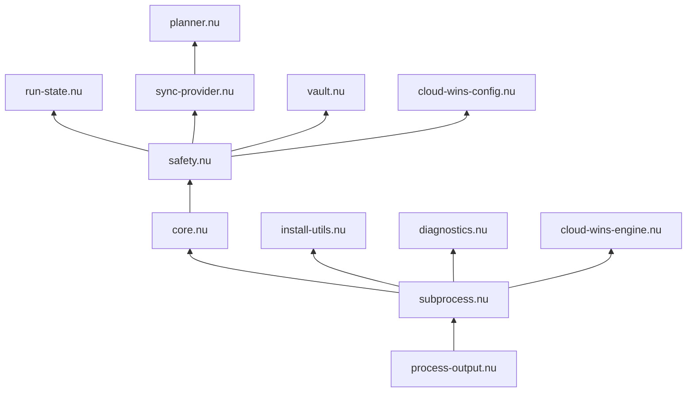

The diagram is a maintenance spine, not a complete import graph. Avoid creating reverse dependencies from low-level infrastructure (`process-output`, `subprocess`, `core`, `safety`) into high-level orchestration.

## Script families

Top-level scripts under `scripts/` are implementation endpoints rather than reusable modules. Use these families to narrow searches.

### Bootstrap, setup, and installation

- `setup-entry.nu`, `runtime-launch.nu`
- `install-auto-sync.nu`, `install-cli-tools.nu`, `install-fonts.nu`, `install-language-tools.nu`, `install-neovim.nu`, `install-rclone.nu`, `install-starship.nu`, `install-vscode.nu`, `install-vscode-extensions.nu`, `install-wezterm.nu`
- `setup-git-identities.nu`, `setup-local-overrides.nu`, `setup-machine-local.nu`, `setup-merge-tool.nu`, `setup-onedrive-ignore-upload.nu`, `setup-platform-shims.nu`, `setup-secrets.nu`, `setup-ssh-keys.nu`, `setup-starship.nu`
- `init-private-data.nu`, `migrate-config.nu`, `migrate-dotfiles.nu`, `cleanup-direnv.nu`, `post-setup-checklist.nu`

### Synchronization and provider operations

- `sync-up.nu`, `sync-down.nu`, `sync-up-local.nu`, `sync-down-local.nu`
- `sync-transport.nu`, `sync-transport-main.nu`, `sync-fingerprint.nu`
- `backend-control.nu`, `resolve-config.nu`, `update-sync-state.nu`, `write-sync-meta.nu`
- `auto-sync.nu`, `auto-sync-main.nu`, `auto-sync-worker.nu`, `lock-status.nu`

### Recovery and environment state

- `backup-local-config.nu`, `create-snapshot.nu`, `rollback.nu`, `run-control.nu`
- `capture-work-environment.nu`, `restore-work-environment.nu`
- `capture-rust-state.nu`, `restore-rust-state.nu`
- `capture-julia-environments.nu`, `restore-julia-environments.nu`
- `capture-vscode-config.nu`, `capture-vscode-extensions.nu`, `apply-vscode-config.nu`
- `capture-rclone-config.nu`, `restore-rclone-config.nu`, `capture-tool-state.nu`, `toolchain-state.nu`

### Cloud-wins

- `cloud-wins.nu`, `cloud-wins-main.nu`, `cloud-wins-build.nu`
- `tools/cloudwins/Cargo.toml`, `tools/cloudwins/src/main.rs`, `tools/cloudwins/src/tests.rs`

### Diagnostics and maintenance

- `doctor.nu`, `audit.nu`, `preflight.nu`, `diagnose-project.nu`, `report.nu`, `repo-status.nu`, `version-info.nu`, `log-event.nu`
- `update.nu`, `update-nushell.nu`, `safe-upgrade.nu`, `release.nu`, `make-release-manifest.nu`
- `refresh-commands.nu`, `refresh-commands-main.nu`
- `plan.nu`, `apply-plan.nu`, `verify-plan.nu`, `new-project.nu`, `secret-vault.nu`

### Validation and regression gates

- `verify.nu` -> `scripts/verify-all.nu` is the main validation path.
- `validate-project.nu` verifies repository structure and policy invariants.
- `validate-syntax.nu`, `syntax-check-file.nu`, and `syntax-self-test.nu` cover syntax-oriented validation.
- `self-test.nu` aggregates behavioral tests.
- Policy tests protect architectural boundaries: `production-subprocess-policy-test.nu`, `installer-health-test.nu`, `orchestration-policy-test.nu`, `interactive-tty-policy-test.nu`, `sync-recovery-policy-test.nu`, `diagnostics-policy-test.nu`, and `wiki-docs-test.nu`.
- Focused tests cover runtime selection, locks, output capture, Cloud-wins, command refresh, vault initialization, entrypoint behavior, and related regressions.

## Verification architecture

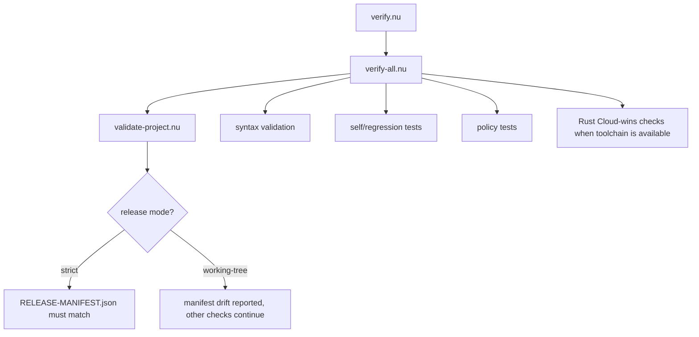

Use:

```nu
nu verify.nu --working-tree
```

while modifying the repository, and use strict validation for a release candidate.

## Change map: where to edit first

| Goal or failure | First files to inspect | Secondary files |
|---|---|---|
| `nu setup.nu` does not start | `setup.nu`, `diagnose-project.nu` | `bootstrap.sh`, `bootstrap.ps1`, `nu-runtime.nu` |
| Setup stops at a named stage | `setup-main.nu`, called script | `run-state.nu`, `subprocess.nu` |
| Resume skips/repeats the wrong stage | `run-state.nu`, `setup-main.nu` | `run-control.nu` |
| External command error is hidden | `subprocess.nu`, immediate caller | `process-output.nu`, `diagnostics.nu` |
| Tool appears installed but does not work | corresponding `install-*.nu` | `install-utils.nu`, tool-specific module |
| Linux bootstrap failure | `bootstrap.sh` | `nu-runtime.nu`, POSIX helpers/tests |
| Windows bootstrap failure | `bootstrap.ps1` | `nu-runtime.nu`, Windows helper scripts |
| `dot*` command routing problem | `modules/dotfiles.nu` | corresponding `scripts/*.nu` endpoint |
| Push/pull provider conflict | `sync-up.nu`/`sync-down.nu` | `sync-provider.nu`, `sync-transport-main.nu` |
| Cloud mirror changes during pull | `sync-provider.nu` | `sync-down.nu`, `sync-transport-main.nu` |
| Backup/restore leaves partial state | `backup-local-config.nu` | `safety.nu` |
| Snapshot/rollback problem | `create-snapshot.nu`, `rollback.nu` | `sync-provider.nu`, `safety.nu` |
| Lock creation/release problem | `safety.nu` | platform lock helper, `lock-status.nu` |
| Protected file overwritten unexpectedly | `conflicts.nu`, `resolve-config.nu` | `sync-down-local.nu`, setup policy |
| Secret/rclone credential problem | `vault.nu`, `secret-vault.nu` | capture/restore rclone scripts |
| Cloud-wins plan/apply problem | `cloud-wins-main.nu` | `cloud-wins-config.nu`, `cloud-wins-engine.nu`, Rust helper |
| `dotdoctor`/audit incorrectly reports healthy | `diagnostics.nu`, `doctor.nu`, `audit.nu` | `install-utils.nu`, `subprocess.nu` |
| Validation incorrectly passes/fails | `verify-all.nu`, `validate-project.nu` | relevant policy test |
| Installed commands point at old checkout | `refresh-commands-main.nu` | `enable-nushell-dotfiles.nu`, machine config |
| Project/runtime update problem | `update.nu`, `safe-upgrade.nu` | `upgrade.nu`, `update-nushell.nu` |

## Modification workflow for maintainers

For future changes, keep the work small and follow the ownership boundary.

1. Identify the layer from the change map above.
2. Change the lowest appropriate implementation layer; avoid duplicating policy in wrappers.
3. Preserve structured subprocess diagnostics instead of translating failures into generic text.
4. Add or update a focused regression test when the bug represents an architectural rule.
5. Run working-tree verification.
6. Update this page only if ownership or call relationships changed, not for every bug fix.
7. Update `CHANGELOG.md` for release-relevant behavior; do not create per-version audit/migration/testing Markdown files.

## Architectural smells to reject

Treat the following patterns as review warnings:

- a new `install.sh` or a second canonical setup entry,
- high-level modules imported by `subprocess.nu`, `core.nu`, or other low-level infrastructure,
- wrapping `setup-main.nu` in captured subprocess execution or attaching user prompts to captured stdout/stderr,
- direct non-interactive external-command capture that bypasses `subprocess.nu`,
- using PATH presence as proof that an executable is healthy,
- optional tools aborting the whole core setup transaction without an explicit reason,
- provider writes without baseline/head checks,
- apply/restore operations without verified staging or a recovery path,
- state files written directly when an atomic record is available,
- Cloud-wins writing back into its cloud source,
- generic wrapper errors that discard the child diagnostic,
- release documentation that duplicates long-lived wiki content.

## Complete top-level script inventory

This index deliberately names every current `scripts/*.nu` file. `wiki-docs-test.nu` checks this inventory so a newly added script cannot remain undocumented indefinitely.

### Setup, installation, and integration

- `cleanup-direnv.nu`
- `enable-nushell-dotfiles.nu`
- `init-private-data.nu`
- `install-auto-sync.nu`
- `install-cli-tools.nu`
- `install-fonts.nu`
- `install-language-tools.nu`
- `install-neovim.nu`
- `install-rclone.nu`
- `install-starship.nu`
- `install-vscode-extensions.nu`
- `install-vscode.nu`
- `install-wezterm.nu`
- `migrate-config.nu`
- `migrate-dotfiles.nu`
- `post-setup-checklist.nu`
- `runtime-launch.nu`
- `setup-entry.nu`
- `setup-git-identities.nu`
- `setup-local-overrides.nu`
- `setup-machine-local.nu`
- `setup-merge-tool.nu`
- `setup-onedrive-ignore-upload.nu`
- `setup-platform-shims.nu`
- `setup-secrets.nu`
- `setup-ssh-keys.nu`
- `setup-starship.nu`
- `winget-package-state.nu`

### Synchronization and provider operations

- `auto-sync-main.nu`
- `auto-sync-worker.nu`
- `auto-sync.nu`
- `backend-control.nu`
- `lock-status.nu`
- `resolve-config.nu`
- `sync-down-local.nu`
- `sync-down.nu`
- `sync-fingerprint.nu`
- `sync-transport-main.nu`
- `sync-transport.nu`
- `sync-up-local.nu`
- `sync-up.nu`
- `update-sync-state.nu`
- `write-sync-meta.nu`

### Recovery and restore

- `backup-local-config.nu`
- `create-snapshot.nu`
- `restore-julia-environments.nu`
- `restore-rclone-config.nu`
- `restore-rust-state.nu`
- `restore-work-environment.nu`
- `rollback.nu`
- `run-control.nu`

### Environment capture and toolchain state

- `apply-vscode-config.nu`
- `capture-julia-environments.nu`
- `capture-rclone-config.nu`
- `capture-rust-state.nu`
- `capture-tool-state.nu`
- `capture-vscode-config.nu`
- `capture-vscode-extensions.nu`
- `capture-work-environment.nu`
- `rclone-config-path.nu`
- `toolchain-state.nu`

### Cloud-wins

- `cloud-wins-build.nu`
- `cloud-wins-main.nu`
- `cloud-wins-test.nu`
- `cloud-wins.nu`

### Diagnostics and inspection

- `audit.nu`
- `diagnose-project.nu`
- `doctor.nu`
- `log-event.nu`
- `preflight.nu`
- `repo-status.nu`
- `report.nu`
- `version-info.nu`

### Maintenance and release

- `make-release-manifest.nu`
- `refresh-commands-main.nu`
- `refresh-commands.nu`
- `release.nu`
- `safe-upgrade.nu`
- `update-nushell.nu`
- `update.nu`

### User operations

- `apply-plan.nu`
- `edit-managed.nu`
- `new-project.nu`
- `plan.nu`
- `secret-vault.nu`

### Validation and regression

- `check-compatibility.nu`
- `diagnostics-policy-test.nu`
- `edit-managed-test.nu`
- `entrypoint-test.nu`
- `installer-health-test.nu`
- `interactive-tty-policy-test.nu`
- `lock-test.nu`
- `nu-runtime-test.nu`
- `orchestration-policy-test.nu`
- `posix-bootstrap-test.nu`
- `process-output-test.nu`
- `production-subprocess-policy-test.nu`
- `rclone-install-test.nu`
- `refresh-commands-test.nu`
- `regression-test.nu`
- `run-state-test.nu`
- `security-self-test.nu`
- `self-test.nu`
- `subprocess-chain-test.nu`
- `subprocess-test.nu`
- `sync-recovery-policy-test.nu`
- `syntax-self-test.nu`
- `validate-project.nu`
- `validate-syntax.nu`
- `vault-init-test.nu`
- `verify-0.13.2.nu`
- `verify-all.nu`
- `verify-plan.nu`
- `wiki-docs-test.nu`

### Other support

- `subprocess-fixture.nu`
- `syntax-check-file.nu`


### Explicit rclone-only transport

`rclone-sync.nu` (`scripts/rclone-sync.nu`) is a thin transport selector used by `dotrpush` and `dotrpull`. It does not rewrite `sync-provider.nuon`. Instead it provides a validated rclone remote through process-local environment overrides, selects a separate provider-state scope, enables transport-only behavior, and suppresses normal global sync-baseline updates.

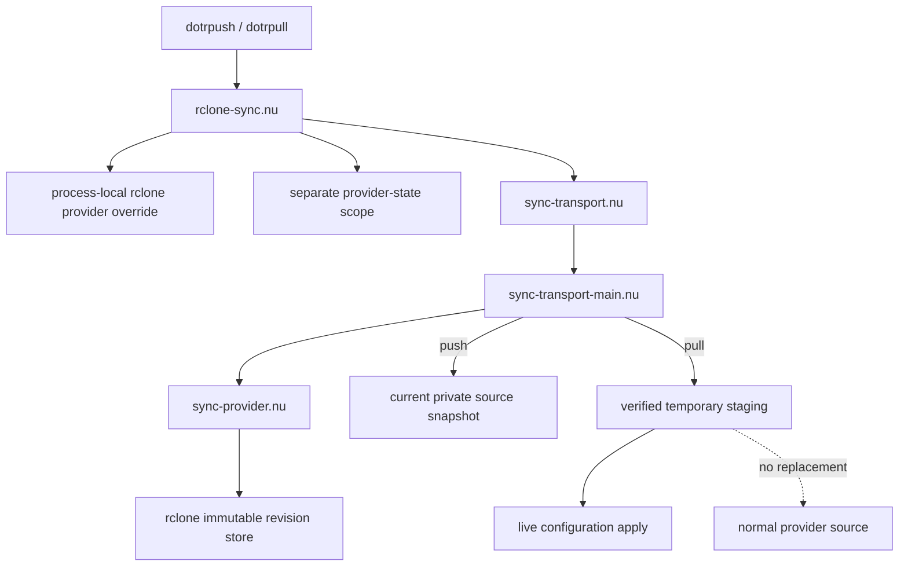

The separation is deliberate: a normal private source may itself live inside a cloud-client directory. Re-capturing or replacing that source during an "rclone-only" operation could unintentionally trigger the other cloud client, so transport-only mode avoids those source mutations.

The isolation contract is guarded by `rclone-explicit-sync-policy-test.nu` and is part of the normal verification suite.

## Changed-source setup reconciliation

- `setup-reconcile.nu` owns the interactive directory-provider conflict menu and verified recovery copy. Only the directly attached setup orchestrator imports this menu; captured setup leaves must not import it.
- `setup-reconcile-test.nu` checks stale-baseline rejection for unattended setup/background writers, recovery with snapshots disabled, and rejection of a source that changes after review. Its optional terminal modes exercise the real entrypoint cancellation and menu choices with an isolated HOME.

- `scripts/modules/sync-local-guard.nu` protects manual pulls from overwriting post-baseline live changes.
